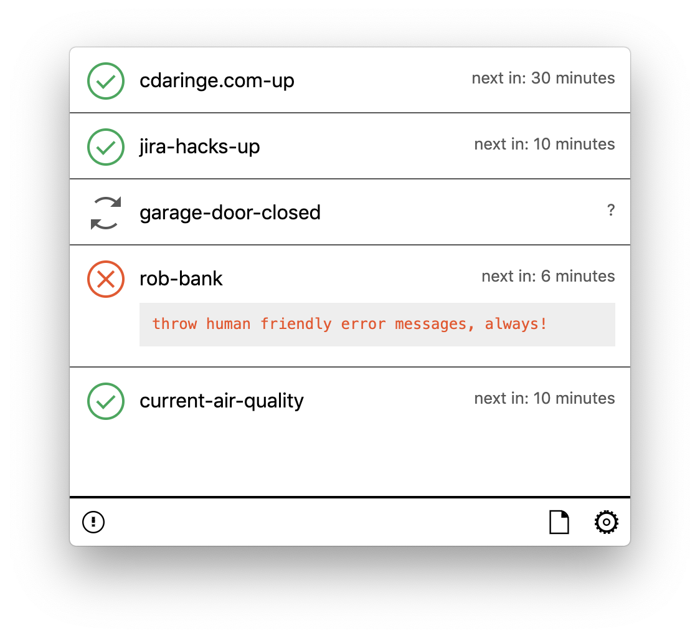

# checkup

Run and visualize status checks

<div style='text-align: center;width: 100%; margin: auto;'>
  
</div>
<div style='text-align: center;width: 100%; margin: auto;'>
  
</div>

Show your health checks as a statusbar icon, and watch it update in realtime.


Check your network service.  check your system daemons.  check your hardware.  check heartbeats, or check workflows.  check with scripts, check with binaries, check with docker, check with `<whatever>`.  we don't care what you check, we just provide a small interface and ui to present those checks in :)

## install

Download the application from the [releases page, here](https://github.com/dino-dna/checkup/releases), for your operating system.

## usage

Upon installation, you already have a working instance, with dummy checks installed and running.  let's add your own.

- open the app, and click the configure button
- open the `config.js` file in the opened directory
  - a template is included to help you get started
- write some checks. `config.js` should export a function named `configure` that returns an array of checks:

```ts
// minimal config
module.exports.configure = (ctx) =>
  [{ name: 'random-check', fn: () => Math.random() > 0.5 }]
```

- save.
- click the `checkup` tray icon, and open/close the window
  - toggling the window should reload your checks
  - observe your new checks loaded!
- enjoy

### launch on startup

if you would like `checkup` to start when your mac starts up, go to `System Preferences > Users and Groups` and add `checkup.app` to "Login Items" for your user

### api

#### config.js

[See the default, template config here](src/configure.template.js).

- export a `configure` function with signature:

  - `module.exports.configure = (toolkit) => [ ...jobs ]`, or
  - `module.exports.configure = (toolkit) => { iconTheme: ..., jobs: [ ...jobs ] }`
    - `iconTheme`: `'stencil_dark'`, `'stencil'`, `'github'`
    - `jobs`: each `Job has the following type signature:

```ts
type Job = {
  name: string
  fn: (jobCtx: JobCtx) => JobResponsePrimative | Promise<JobResponsePrimative>
  pollDurationMs?: number // default: 10 minutes (60000 * 10)
  state: { ... } // @private. do not try to set or use `state`
}
type JobResponsePrimative = boolean | string
type JobCtx = { log: Logger } // log({ level: 'warn|info|error', message: 'my job is the best!' })
```

see above for examples.

#### toolkit

configure receives a `toolkit` object, which has a few modules embedded:

- `toolkit.fs` - filesystem io - https://www.npmjs.com/package/fs-extra
- `toolkit.fetch` - network/http io - https://www.npmjs.com/package/node-fetch
- `toolkit.execa` - child process io - https://www.npmjs.com/package/execa
- `toolkit.log` - logger. `log({ level: "info", message: "my healthcheck is going swell!" })`

because so many health check operations are centered around local and remote i/o, these dependencies are injected for your convenience.

```js
// config.js
module.exports.configure = (toolkit) => [/* ... */]

// config.js
module.exports.configure = ({ fs, execa, fetch }) => [/* ... */]
```

### not into javascript?

Not a js fan? Perhaps you just want to run some other binary for a health check?
We get it. No problem--just fire off a subprocess to run _your thing_.
You can `require('child_process')` and use that, but it's advised to use the
`execa` function, which is passed in for you:

```js
// config.js
// @example - child process
module.exports.configure = ({ execa }) => [{
  name: 'disk-check',
  fn: () => execa('fsck', ['-fy', '/dev/sda2'])
}]
```

## contributing

### bootstrap

- `nvm use`
- `yarn`
- `yarn build:watch`
  - starts the compiler and the web bundler
- `yarn electron` from another shell. alternatively, use the VSCode launch configuration to boot the app
